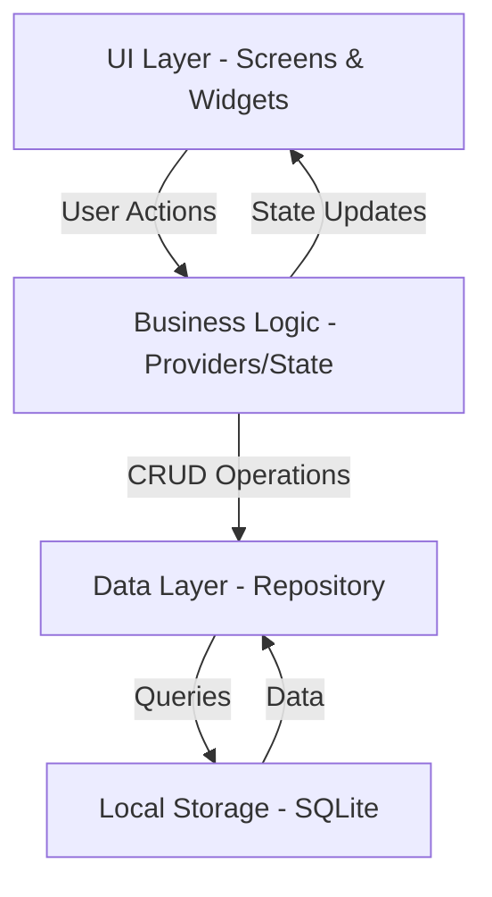

# Expense Tracker MVP Plan

## Architecture Overview



## Data Model Design

### Transaction Model
```dart
class Transaction {
  int? id;
  double amount;
  String merchant;
  DateTime date;
  String categoryId;
  String paymentMethod; // Cash, Card, UPI, Net Banking
  String? notes;
  DateTime createdAt;
  DateTime updatedAt;
}
```

### Category Model
```dart
class Category {
  String id;
  String name;
  String icon; // Material icon name
  String color; // Hex color code
  bool isDefault; // true for predefined, false for custom
}
```

### Predefined Categories
- Food & Dining
- Transportation
- Shopping
- Bills & Utilities
- Entertainment
- Healthcare
- Education
- Others

## Project Structure

```
lib/
├── main.dart
├── models/
│   ├── transaction.dart
│   └── category.dart
├── services/
│   ├── database_service.dart
│   └── category_service.dart
├── providers/
│   ├── transaction_provider.dart
│   └── category_provider.dart
├── screens/
│   ├── home_screen.dart
│   ├── add_transaction_screen.dart
│   ├── transaction_list_screen.dart
│   ├── monthly_summary_screen.dart
│   └── category_breakdown_screen.dart
├── widgets/
│   ├── transaction_card.dart
│   ├── category_selector.dart
│   ├── month_selector.dart
│   └── summary_card.dart
└── utils/
    ├── constants.dart
    └── date_utils.dart
```

## Technology Stack

### Dependencies to Add
- **sqflite**: Local SQLite database for offline storage
- **path**: Database file path management
- **provider**: State management
- **intl**: Date formatting and currency formatting
- **fl_chart** (future): For charts when needed post-MVP

### Database Schema

**transactions table:**
- id (INTEGER PRIMARY KEY)
- amount (REAL)
- merchant (TEXT)
- date (TEXT - ISO8601)
- category_id (TEXT)
- payment_method (TEXT)
- notes (TEXT)
- created_at (TEXT)
- updated_at (TEXT)

**categories table:**
- id (TEXT PRIMARY KEY)
- name (TEXT)
- icon (TEXT)
- color (TEXT)
- is_default (INTEGER - 0 or 1)

## Core Features Implementation

### 1. Add Transaction Screen
- Form with fields: Amount, Merchant, Date picker, Category dropdown, Payment method dropdown, Notes (optional)
- Validation: Amount > 0, Merchant required, Category required
- Save to database and update state

### 2. Transaction List Screen
- Display all transactions in chronological order (newest first)
- Show: Amount, Merchant, Category badge, Date, Payment method
- Swipe actions: Edit and Delete
- Search bar to filter by merchant name
- Filter dropdown: By category, by payment method, by date range

### 3. Monthly Summary Screen
- Month selector (current month by default)
- Total spending display (large, prominent)
- Quick stats: Transaction count, average per transaction
- Navigate to detailed category breakdown

### 4. Category Breakdown Screen
- List of categories with spending amount and percentage
- Visual representation: Progress bars showing relative spending
- Tap category to see transactions in that category
- Option to manage (add/edit/delete) custom categories

### 5. Home Screen (Dashboard)
- Quick add transaction button (FAB)
- Current month summary card
- Recent transactions (last 5-10)
- Navigation to all sections

## Implementation Approach

### Phase 1: Foundation
1. Set up database service with SQLite
2. Create models with toMap/fromMap methods
3. Initialize database with predefined categories
4. Set up providers for state management

### Phase 2: Core CRUD
1. Implement transaction repository (add, edit, delete, get)
2. Implement category repository
3. Build add transaction screen with form validation
4. Build transaction list with edit/delete functionality

### Phase 3: Display & Analytics
1. Build monthly summary calculations
2. Implement category breakdown logic
3. Create summary and breakdown screens
4. Add search and filter functionality

### Phase 4: Polish
1. Design consistent UI theme
2. Add loading states and empty states
3. Input validation and error handling
4. Test offline functionality

## Key Implementation Notes

- **Date Handling**: Store dates in UTC, display in local time
- **Currency**: Store as double, display with 2 decimal places using `NumberFormat.currency()`
- **State Management**: Use Provider with `ChangeNotifier` for reactive UI updates
- **Database Initialization**: Seed predefined categories on first app launch
- **Offline-First**: All operations work without network; data persists across app restarts
- **Edit Flow**: Pre-populate form with existing data when editing
- **Delete Confirmation**: Show confirmation dialog before deleting transactions

## Success Criteria

- Users can add, edit, and delete transactions with all required fields
- App works completely offline with no network dependency
- Monthly spending totals are accurate
- Category breakdown shows correct percentages
- Search and filter work as expected
- Data persists across app restarts
- UI is clean, intuitive, and responsive
